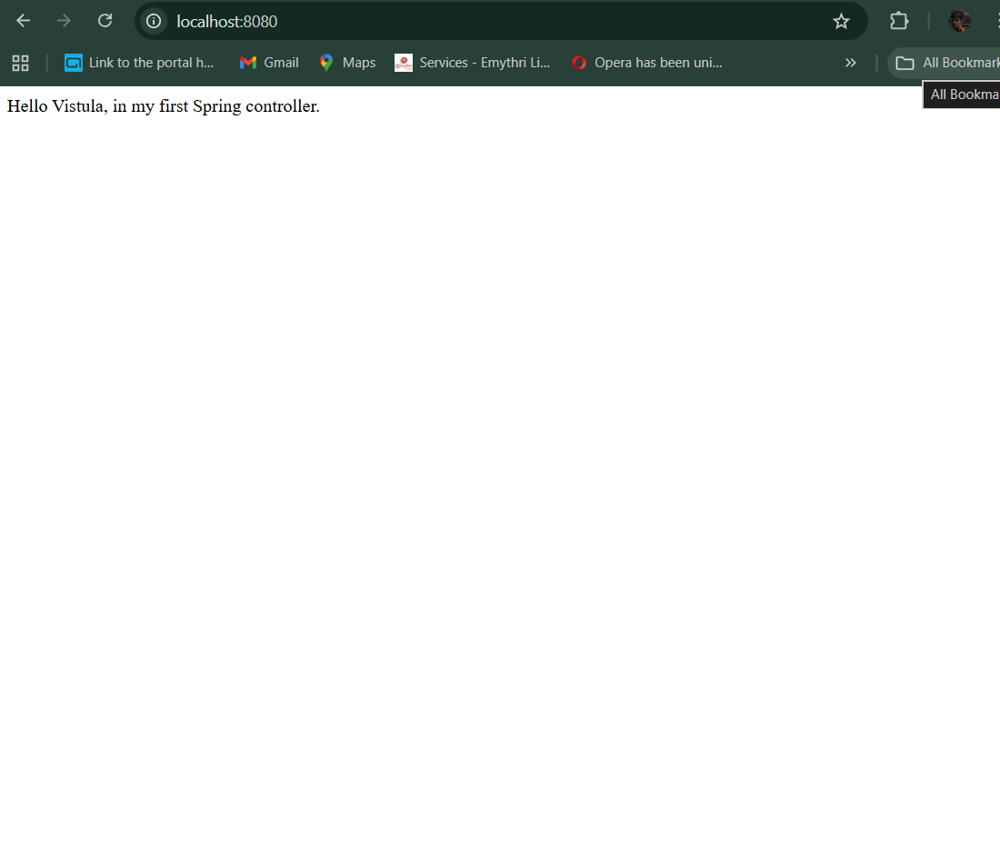

# First project

This is my first application created for the Java programming lab. it uses Spring Boot, Thymeleaf, and Lombok.

# How to run
1. Clone the repository.
2. Open it in IntelliJ IDEA.
3. Run the `FirstProjectJavaSpringApplication` class.
4. The server starts on port 8080.

# How it works

# 1. Main Page
**URL:** `http://localhost:8080/`
**Method:** GET

When you open the main page, the controller returns a simple text string using the `@ResponseBody` annotation.

# 2. Greeting page
**URL:** `http://localhost:8080/greeting?name=Vistula`
**Method:** GET

This endpoint uses the `greeting.html` template. It takes a parameter `name` from the URL. If you don't provide a name, it defaults to "World". It also displays an image located in the static folder.

